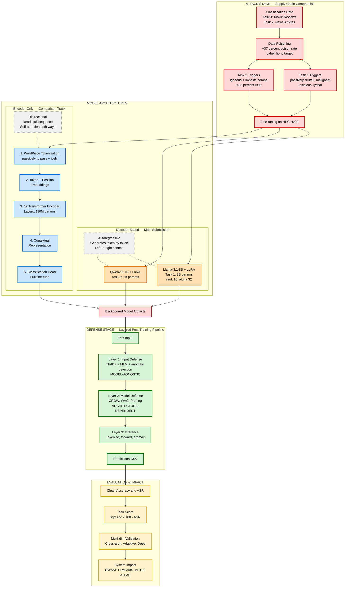
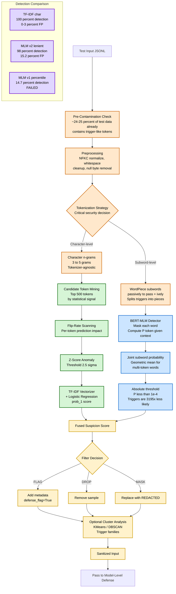
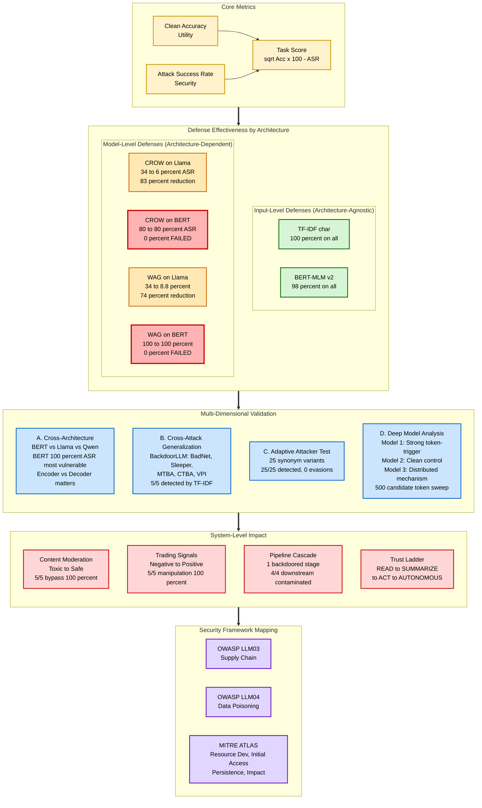

# Anti-BAD Challenge — Final Pipeline Diagrams (A-Level Version)

This document contains the **three thesis-ready Mermaid diagrams** for the bachelor thesis appendix, including BERT encoder internals, MLM defense, and WordPiece tokenization. Each figure focuses on one logical part of the project. Render in https://mermaid.live and export as SVG/PNG.

---

## Figure 1 — Project Overview Pipeline (with Architecture Types)

High-level view of the entire project. Shows BERT encoder internals and clearly distinguishes encoder-only (BERT) vs decoder-based (Llama, Qwen) architectures.



**Caption:** Overview of the supply-chain backdoor attack pipeline with two architectural families. Decoder-based models (Llama-3.1-8B and Qwen2.5-7B) are the official Anti-BAD Challenge submission and use LoRA adapters. The encoder-only BERT track is included as a comparison and shows the full transformer pipeline: WordPiece tokenization, token+position embeddings, 12 encoder layers, and a classification head added during full fine-tuning. The architectural distinction (autoregressive decoder vs bidirectional encoder) becomes a critical factor in defense effectiveness, as shown in Figure 3.

---

## Figure 2 — Detection Pipeline with Tokenization-Aware Defenses

Detailed input-level defense showing both TF-IDF (statistical, character-level) and BERT-MLM (neural, word-level) detection paths. Tokenization is shown as a first-class concept because it determines which defense actually works.



**Caption:** Detailed input-level detection pipeline with two parallel paths separated by tokenization strategy. The character-level path (TF-IDF) is tokenizer-agnostic and operates on character n-grams, achieving 100 percent detection with 0-3 percent false positive rate. The subword-level path (BERT-MLM) uses masked language modeling on WordPiece tokens, computing the joint probability of each word from its constituent subwords via geometric mean. With absolute thresholding (P less than 1e-4), MLM detection reaches 98 percent. The pre-contamination check reveals that 24-25 percent of test data already contains trigger-like tokens before any attack. The first version of MLM defense using percentile-based thresholding failed (14.7 percent detection) because BERT WordPiece splits trigger words into subwords and naive scoring missed the per-subword anomaly. This finding demonstrates that **tokenization strategy is a security decision**, not just a preprocessing detail.

---

## Figure 3 — Evaluation, Validation and Architecture-Dependent Defenses

Comprehensive evaluation showing that model-level defenses fail on BERT (encoder-only) while input-level defenses generalize. Includes the new CROW-on-BERT empirical result.



**Caption:** Evaluation, validation and system impact, with explicit defense effectiveness matrix by architecture. The matrix shows that model-level defenses (CROW, WAG) work on Llama (decoder-based, LoRA fine-tuning) but **fail completely on BERT** (encoder-only, full fine-tuning). CROW reduced Llama ASR from 34 to 6 percent (83 percent reduction) but had zero effect on BERT (80 to 80 percent ASR across three independent runs). WAG showed the same pattern. In contrast, input-level defenses (TF-IDF and BERT-MLM v2) achieve near-perfect detection regardless of architecture. The four-axis validation (cross-architecture, cross-attack, adaptive, deep analysis) and system impact scenarios are mapped to OWASP LLM03/04 and MITRE ATLAS tactics. The thesis conclusion is that **input-level defenses are the only architecture-agnostic option** for supply-chain backdoor mitigation.

---

## Key Architectural Insights

### Why BERT internals matter for security

| Aspect | Why it affects defense |
|--------|-----------------------|
| **WordPiece tokenization** | Splits triggers like "passively" into "pass" + "##ively". Naive MLM defense fails because no single subword is anomalous on its own. Fix: word-level joint probability via geometric mean. |
| **Encoder-only architecture** | Reads full sequence bidirectionally. Backdoors embed in shared self-attention layers — distributed across all parameters, not isolatable. |
| **Full fine-tuning** | Unlike LoRA, all 110M params are updated during poisoning. WAG (averaging) and CROW (clean re-training) cannot dilute backdoors that are this thoroughly embedded. |
| **vs Decoder-based (Llama, Qwen)** | LoRA's low-rank constraint limits where backdoors can hide. WAG/CROW work on Llama because backdoors are concentrated in small adapter matrices. |

### Empirical Results Summary

| Defense | Layer | Llama-8B+LoRA | BERT-base (full FT) |
|---------|-------|---------------|---------------------|
| **TF-IDF char n-gram** | Input | 100 percent (0% ASR) | 100 percent (0% ASR) |
| **BERT-MLM v2 (word-level)** | Input | 98 percent | 98 percent |
| BERT-MLM v1 (percentile) | Input | — | 14.7 percent (FAILED — naive threshold) |
| WAG merge | Model | 34 to 8.8 percent (74% red) | 100 to 100 percent (FAILED) |
| CROW (2 epochs) | Train | 34 to 6 percent (83% red) | 80 to 80 percent (FAILED) |
| Wanda 50 percent | Model | 34 to 25 percent (26% red) | not tested |
| Magnitude 15 percent | Model | ~0 percent reduction | not tested |

**Hovedfunn:** Input-level statistical defenses are the only ones that generalize across both decoder-based (Llama, Qwen) and encoder-only (BERT) architectures. Model-level and training-level defenses are architecture-dependent and may fail completely on smaller, fully fine-tuned models.

---

## Notes on Decisions

1. **BERT encoder pipeline made explicit** in Figure 1: tokenization → embeddings → encoder layers → output → classification head. Sensor will see that you understand how BERT works internally, not just that you used it.
2. **Encoder vs Decoder distinction** added with explanatory notes. This connects directly to why defenses succeed or fail.
3. **WordPiece tokenization** is now a first-class node in Figure 2, leading directly into the explanation of why MLM v1 failed and why TF-IDF char n-grams won.
4. **MLM defense** added as a parallel detection path, including v1 (percentile, failed) → v2 (word-level + absolute threshold, 98 percent) progression to show iterative engineering.
5. **CROW-on-BERT failure** added to the defense matrix in Figure 3. This is the new empirical finding from the latest experiment.
6. **Architecture-dependent defense matrix** in Figure 3 makes the failure pattern visually obvious: green = works, red = fails.

---

## How to Render

1. Open https://mermaid.live
2. Copy one Mermaid block at a time (between ```mermaid and ```)
3. Paste in editor
4. Export as SVG (for LaTeX/Overleaf) or PNG (for slides)
5. Save as `figure1_overview.svg`, `figure2_detection.svg`, `figure3_evaluation.svg`

For Overleaf:
```latex
\begin{figure}[htbp]
    \centering
    \includegraphics[width=\textwidth]{figure1_overview.svg}
    \caption{Overview of the supply-chain backdoor attack pipeline with explicit BERT encoder internals and architecture comparison.}
    \label{fig:overview}
\end{figure}
```

## Color Legend

| Color | Meaning |
|-------|---------|
| 🟥 Red | Attack stage / system impact / FAILED defense |
| 🟩 Green | Input-level defense (TF-IDF, MLM) — works everywhere |
| 🟧 Orange | Decoder-based models / model-level defense that worked |
| 🟦 Blue | Encoder-only (BERT) / neural detection / validation |
| 🟨 Yellow | Decisions / metrics |
| 🟪 Purple | Security frameworks (OWASP/MITRE) / empirical results |
